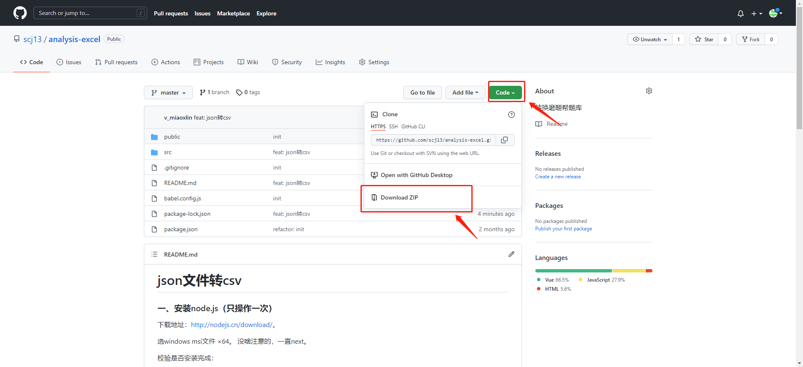
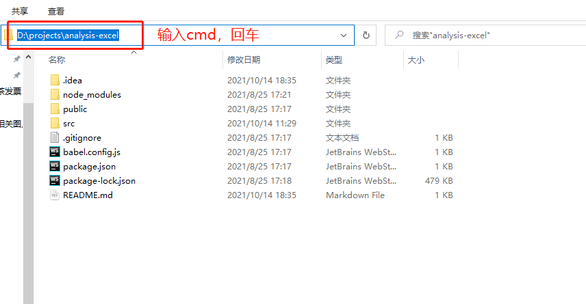
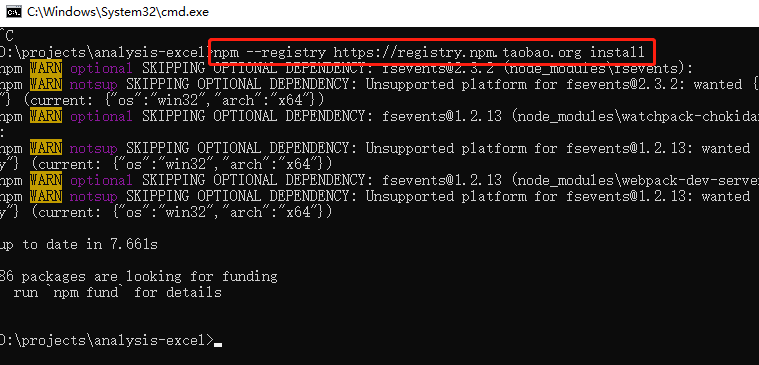
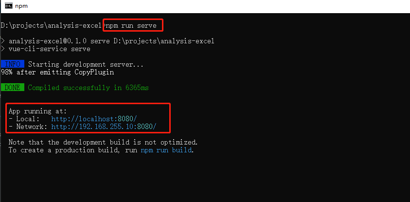

# json文件转csv
### 一、安装运行环境-node.js（只操作一次）
下载地址：http://nodejs.cn/download/。

选windows msi文件 ×64。 没啥注意的，一直next。

校验是否安装完成：

1. 快捷键`win+r`，输入`cmd`，回车。

2. 输入`node -v`和`npm -v`。有提示版本号代表安装成功

### 二、下载程序

### 三、运行程序
1. 进入analysis-excel目录，在上方地址栏输入`cmd`，回车。

2. 输入`npm --registry https://registry.npm.taobao.org install`安装依赖，等待安装完成（只操作一次）。

3. 输入`npm run serve`启动程序，启动成功后会看到如下内容，浏览器地址栏输入http://localhost:8080/ 就能访问啦。

